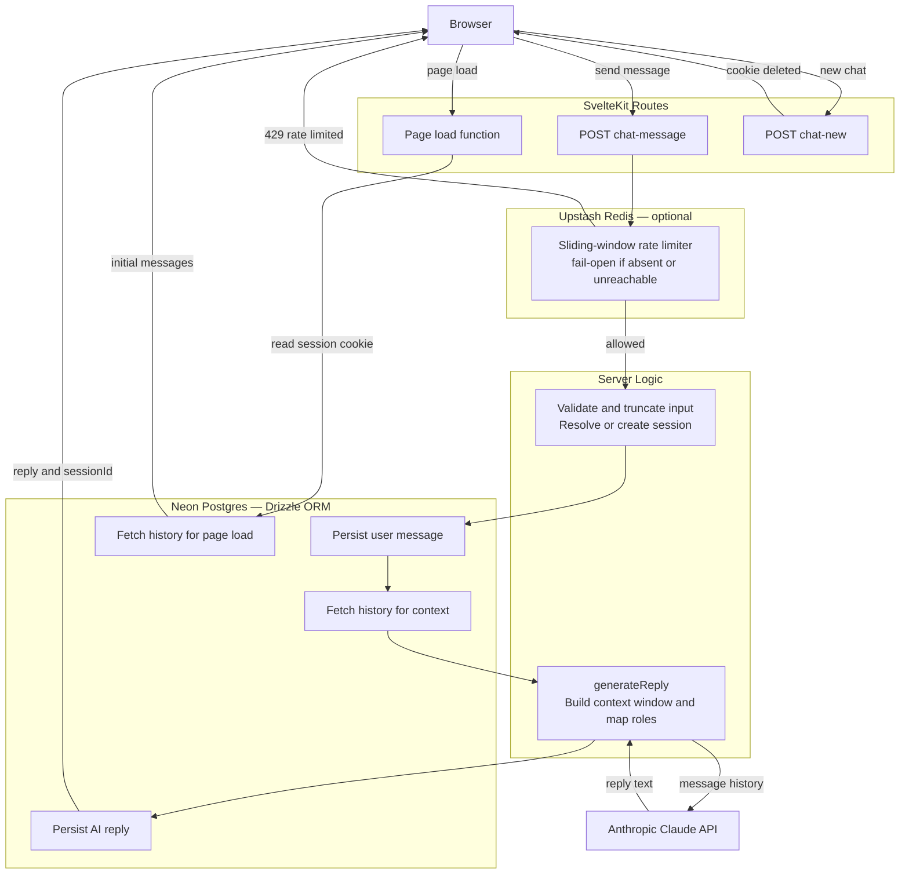

# Spur Take-Home — AI Live Chat Support Agent

**Deployed:** https://spur-chat-agent-bice.vercel.app/

Users chat with **Aria**, a support agent for a fictional home-goods store (Maple & Co.). Messages persist to Postgres via a session cookie, so conversations survive page reloads.

---

## Tech Stack

| Layer | Choice |
|---|---|
| Framework | SvelteKit (TypeScript) |
| Database | PostgreSQL via [Neon](https://neon.tech) + [Drizzle ORM](https://orm.drizzle.team) |
| LLM | Anthropic Claude (`claude-sonnet-4-6`) |
| Rate limiting | [Upstash Redis](https://upstash.com) + `@upstash/ratelimit` (optional) |
| Styling | Tailwind CSS v4 |

---

## Run Locally

**Prerequisites:** Node.js ≥ 18, a Neon database, an Anthropic API key.

```bash
git clone <repo-url>
cd spur-chat-agent
npm install
cp .env.example .env   # fill in DATABASE_URL and ANTHROPIC_API_KEY
npx drizzle-kit push   # create tables in Neon
npm run dev
```

Open [http://localhost:5173](http://localhost:5173).

---

## Database Setup

1. Create a free project at [neon.tech](https://neon.tech).
2. Copy the **HTTP/serverless** connection string (not the pooled TCP one).
3. Set it as `DATABASE_URL` in `.env`, then run `npx drizzle-kit push`.

Tables created:

| Table | Columns |
|---|---|
| `conversations` | `id` (uuid PK), `created_at` |
| `messages` | `id` (uuid PK), `conversation_id` (FK), `sender` (`user`\|`ai`), `text`, `created_at` |

---

## Environment Variables

```
# Required
DATABASE_URL=               # Neon HTTP connection string
ANTHROPIC_API_KEY=          # Anthropic API key

# Optional — rate limiting (app runs fine without these)
UPSTASH_REDIS_REST_URL=
UPSTASH_REDIS_REST_TOKEN=
```

`DATABASE_URL` and `ANTHROPIC_API_KEY` are validated at startup — the app throws immediately if either is missing. Upstash vars are optional; if absent, the rate limiter is a no-op.

---

## Architecture



**Layers:**
- `routes/` — HTTP concerns: parsing, cookies, status codes
- `lib/server/llm.ts` — LLM call, role alternation, error handling
- `lib/server/db/` — all database access (Drizzle queries)

`generateReply` and the DB helpers are channel-agnostic — adding a WhatsApp webhook means a new route calling the same functions; the LLM and DB layers need no changes.

---

## LLM

- **Model:** `claude-sonnet-4-6`, `max_tokens: 512`
- **System prompt:** hardcoded with Aria's persona and Maple & Co. FAQ (shipping, returns, support hours) — no retrieval step, low latency
- **Context window:** last 10 messages; strict role alternation enforced before sending to the API
- **Errors:** all Anthropic error classes caught, logged server-side, returned as a friendly fallback string — the route never receives a thrown exception

---

## Robustness

- Empty or whitespace-only messages → 400 before touching the DB
- Messages over 4 000 chars → silently truncated, still processed
- Invalid/stale session IDs → validated as UUID format + checked against DB; creates a new conversation if not found
- User message persisted **before** the LLM call — no silent data loss on LLM failure
- New Chat hits `POST /chat/new` to delete the cookie server-side before clearing local state
- Rate limiting: sliding window, 10 req / 10 s per IP, fail-open (Redis unreachable → request proceeds)
- Top-level try/catch in every route — clean JSON 500, no stack traces to the client

---

## Trade-offs & If I Had More Time

- **Streaming** — chose `POST → JSON` for simplicity; SSE token streaming is the obvious next step for perceived latency
- **Auth** — anonymous cookies; a real product needs user identity for cross-device history
- **Redis session cache** — each request re-queries the DB to validate the session; a cache in front of `conversationExists` would cut that round-trip
- **FAQ retrieval** — knowledge is hardcoded in the prompt; a vector search step would handle a larger or frequently-changing knowledge base without redeployment
- **UI polish** — missing timestamps, copy-to-clipboard, retry button, accessibility audit
- **Tests** — none; priority would be `buildMessages` role-alternation edge cases, `generateReply` error branches, and route input validation
